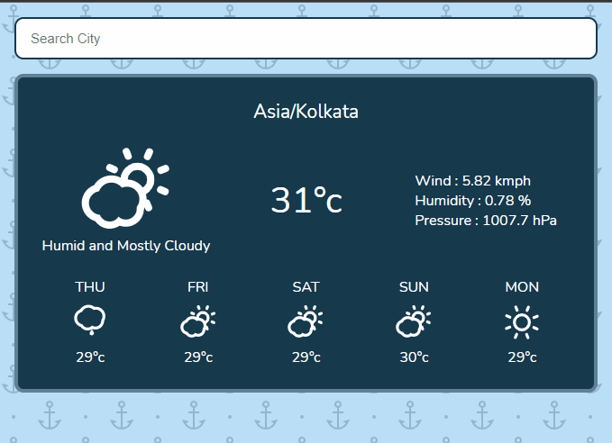

# Weather App

Simple weather app using nodeJs and the API Dark Sky

# Preview

Live demo [Weather App](https://darksky-weather-forecast.herokuapp.com/)

# Usage

Create account on [Darksky](https://darksky.net),
Then copy you API key, then rename .env_sample to .env

    # DARKSKY_API="pest here the apt key"

Then run the file name server.js and then open localhost:5000 on your brower

    # node server.js
          or
    # npm run devStart
